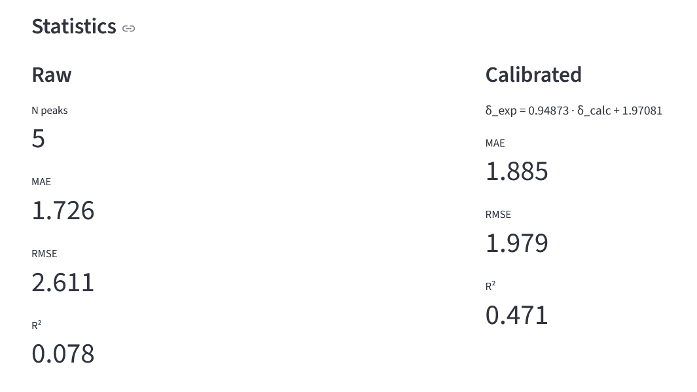
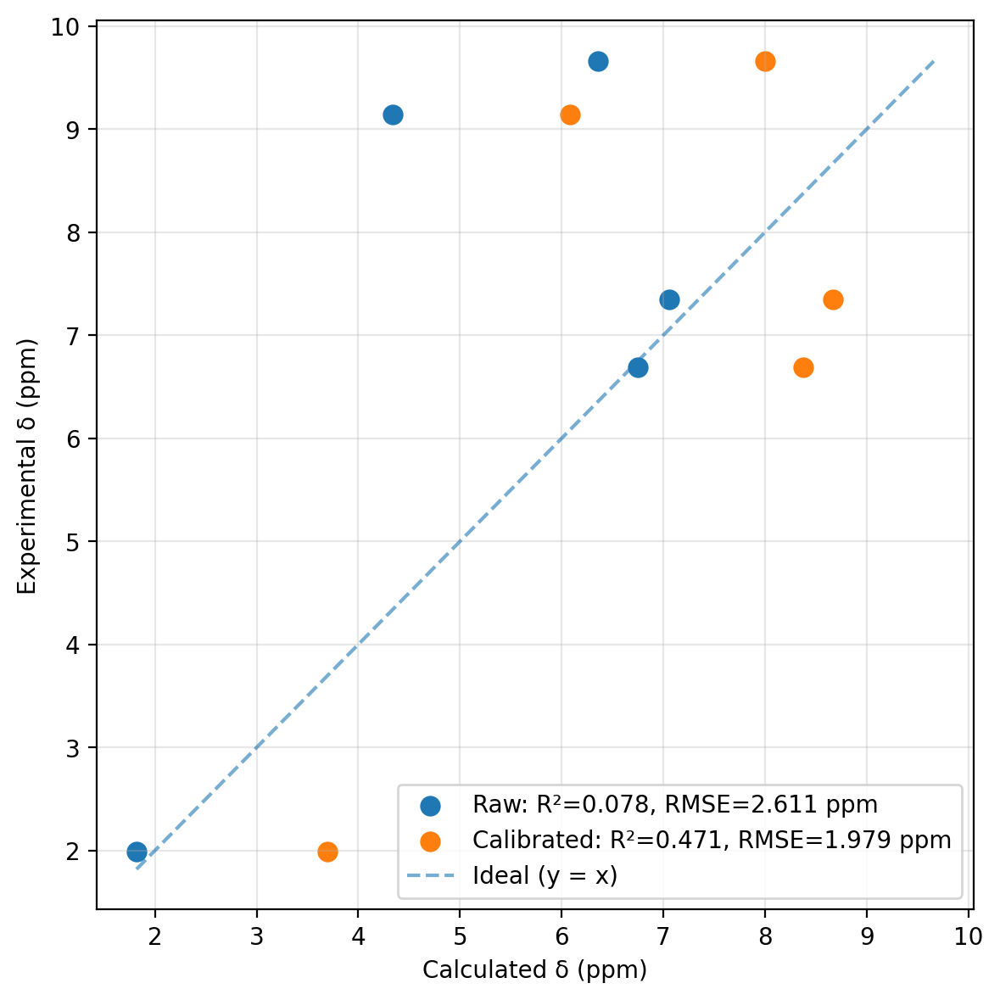
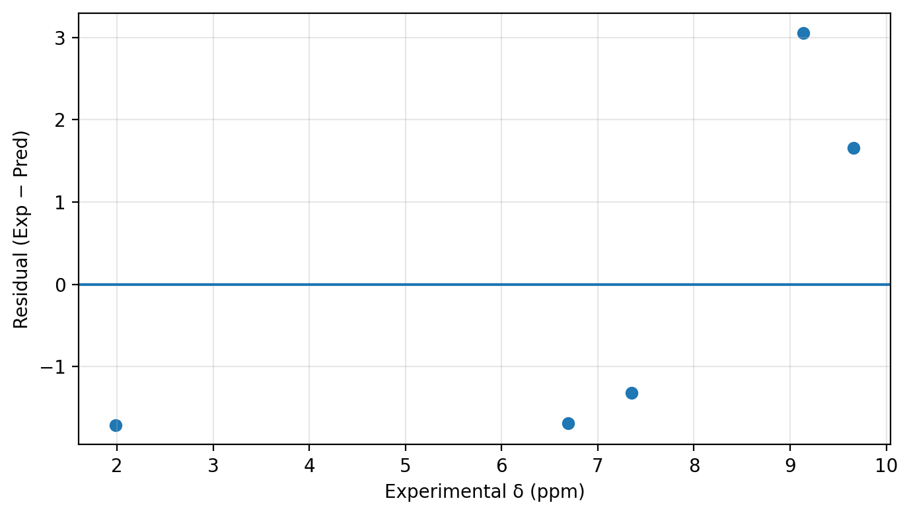

# NMR Computations (Gaussian ¹H NMR → assignment, grouping & calibration)

[](https://github.com/jacekkuj/NMR_computations/actions/workflows/ci.yml)
[](#)
[](#license)
[](#running-the-app)

A lightweight Streamlit app that:
- parses **Gaussian** logs in the section `SCF GIAO Magnetic shielding tensor (ppm):`
- extracts **¹H isotropic shieldings**
- converts them to chemical shifts using `δ(¹H) = H_ref − σ_iso`
- supports manual experimental assignment per proton
- performs peak-level grouping and optional **linear calibration** (Exp vs Calc)
- reports statistics (MAE, RMSE, R², Pearson/Spearman) and publication-ready plots

## Application interface





## Calibration & correlation





## Installation

### Option A: pip (recommended)
```bash
python -m venv .venv
# Windows PowerShell:
.\.venv\Scripts\Activate.ps1
pip install -r requirements.txt

## Scientific background

DFT-computed NMR isotropic shieldings (σ) were converted to chemical shifts using:

δ(¹H) = σ_ref − σ_iso

Linear calibration was performed following common literature practice:

δ_exp = a · δ_calc + b

This approach is widely used in:
- J. Org. Chem.
- PCCP
- J. Chem. Theory Comput.
